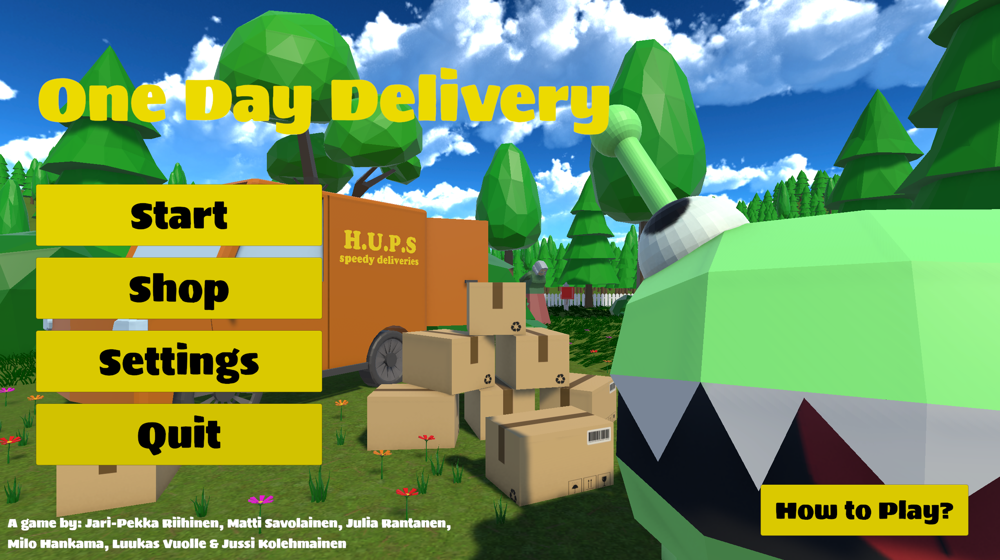

# One Day Delivery 
*A 3D First-Person Delivery Game Made with Unity by Team H.U.P.S.*



**One Day Delivery** puts you in the nimble shoes of an orangutan working for H.U.P.S—delivering packages with speed, style, and precision. Built in Unity, the game blends light-hearted chaos with time-based challenges across vibrant 3D environments.

---

## Team H.U.P.S

- **Producer**: Jari-Pekka Riihinen  
- **Game Design**: Matti Savolainen  
- **Graphics**: Julia Rantanen  
- **Sound Design**: Milo Hankama  
- **Programmers**: Jussi Kolehmainen & Luukas Vuolle  

---

## Gameplay

You are an orangutan delivery employee at H.U.P.S, and your mission is to deliver packages to the mailboxes before time runs out.

- Use the **mailbox compass** to find delivery points.
- Each level has multiple mailboxes — one package per mailbox.
- Once all packages are delivered, return to the van to complete the level.

### Controls (Keyboard & Mouse)

| Key / Mouse       | Action                          |
|-------------------|---------------------------------|
| `W A S D`         | Move                            |
| `Space`           | Jump *(Hold to bunny hop)*      |
| `Shift`           | Walk                            |
| `Mouse 1`         | Pick up / Drop package          |
| `Mouse 2`         | Throw package                   |
| `E`               | Store package in inventory      |
| `Q`               | Retrieve package from inventory |
| `ESC`             | Open pause menu                 |
| `F1`              | Restart level                   |

---

## Installation

To try the game or explore the code:

```bash
git clone https://github.com/LuukasV/postipeli.git
```

You are welcome to fork or clone the repository for personal use or experimentation.

**NOTE** Contributions to this repository are not accepted via pull requests or direct pushes, even when public.

## Usage
- Download and install Unity Hub at https://unity.com/download
- Game has been developed with editor version **6000.0.34f1**
- In Unity Hub, click **Add**, and select `OneDayDelivery` folder to open the project.

## Developement
This repository is maintained exclusively by Team H.U.P.S. While the project will be open-source, external contributions are not accepted. You are, however, encouraged to fork and modify the game for your own purposes.

## License
This project is licensed undet the MIT License. See the [LICENSE](LICENSE.txt) file for more details.